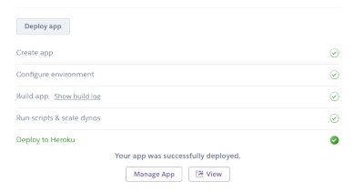
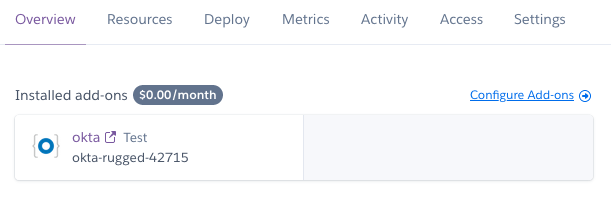

# OAuth and OIDC by Example

This repository supports the "OAuth and OIDC by Example" workshop to guide you
through the setup and deployment of Okta as an OAuth identity provider to your
applications.

This example uses a simple Node.js server to demonstrate the different flows
available to you however the principals apply to any platform. This sample uses
direct calls to the identity provider to demonstrate each stage, However it is
recommended that you use a prebuild implementation standard to integrate your
production applications. Certified implementations can be found
[here](https://openid.net/developers/certified/).

## Getting Started

This workshop uses a simple node application deployed to Heroku to guide you.
To provision you an instance of Okta to use with the example we are using the
[Beta Okta Heroku add on](https://devcenter.heroku.com/articles/okta).

Prestep
You will need a Heroku account to continue, please create one here if you do not
already have one and make sure you are signed in.

This demonstration only provisions free resources and will not cost you anything
to run.

You will be presented a screen like the following, give you application a name
and press "Deploy app"

Once deployment has completed press "View" to launch your application.

Congratulations you have now deployed your first OIDC application with Okta!

## View your Okta console

When you have deployed with the Okta Heroku integration you can access your
Okta tenant directly from Heroku.

Within your application select the 'Overview' tab an click the Okta button from
the installed add-ons list.

Clicking the logo will single sign-on you into your brand new Okta
tenant, this tenant is yours forever. This tenant is on our free Developer tier,
you can compare the different tiers [here](https://developer.okta.com/pricing/).

## Next Steps

Now that your application is fully deployed on Heroku you have a public facing
address with which you can explore the workshop. This application will have
opened when deployment finished but you can launch this from your Heroku console
at any time.

The application is setup to guide you through the different OAuth and OIDC flows
and how they can be configured with Okta.