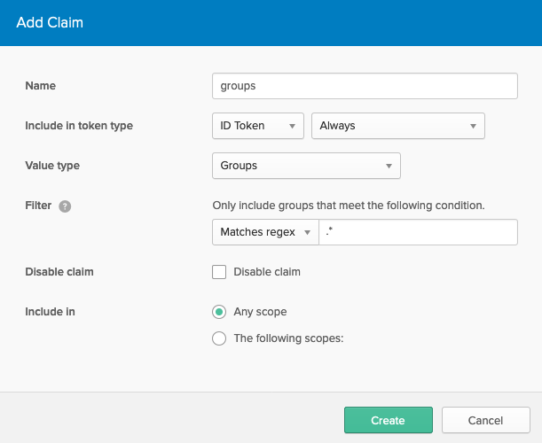

# OAuth and OIDC by Example

This repository supports the "OAuth and OIDC by Example" workshop to guide you
through the setup and deployment of Okta as an OAuth identity provider to your
applications.

This example uses a simple Node.js server to demonstrate the different flows
available to you however the principals apply to any platform. This sample uses
direct calls to the identity provider to demonstrate each stage, However it is
recommended that you use a prebuild implementation standard to integrate your
production applications. Certified implementations can be found
[here](https://openid.net/developers/certified/).

## Getting Started

This workshop uses a simple node application deployed to Heroku to guide you.
To provision you an instance of Okta to use with the example we are using the
[Beta Okta Heroku add on](https://devcenter.heroku.com/articles/okta).

Prestep
You will need a Heroku account to continue, please create one here if you do not
already have one and make sure you are signed in.

This demonstration only provisions free resources and will not cost you anything
to run.

[](https://heroku.com/deploy)

You will be presented a screen like the following, give you application a name
and press "Deploy app"


Once deployment has completed press "View" to launch your application.


Congratulations you have now deployed your first OIDC application with Okta!

## View your Okta console

When you have deployed with the Okta Heroku integration you can access your
Okta tenant directly from Heroku.

Within your application select the 'Overview' tab an click the Okta button from
the installed add-ons list.


Clicking the logo will single sign-on you into your brand new Okta
tenant, this tenant is yours forever. This tenant is on our free Developer tier,
you can compare the different tiers [here](https://developer.okta.com/pricing/).

## Next Steps

Now that your application is fully deployed on Heroku you have a public facing
address with which you can explore the workshop. 

Press ```view app``` in your Heroku console to launch the application.

## Exercises

### Use the authentication code grant

- Create a user in Okta's directory
    - SSO into the Okta console from Heroku.
    - Hover over ```users``` and select ```people``` from the dropdown menu
    - Press ```Add Person```
    - Fill in the form and press save (the email address can be fake if you set
      the password as administrator)
- Open the application in a private browser window
- Select ```user to service``` identity.
- Note the scopes being requested are ```openid profile demonstration:perform
  offline_access``` these include openid connect standard scopes so you will
  receive an id token to describe your user to the application as well as an access token.
- Enter the credentials of your test user.
- Note the information returned on id token:
    - sub is the unique id of the user at the IDP
    - aud is the client id of the application
    - name shows your test user's full name 
    - preferred_username is the user's email.
    - amr shows which factors you used to authenticate
    - auth_time shows when authentication was perfroms
- Note the information on the access token:
    - sub is your email address
    - scp is the list of scopes which were requested
    - aud is a value defined by the IDP for receipients to check

### Validate your tokens

- Signed into the application as your test user.
- Select ```Verify token```.
- Ensure that verification completes successfully.
- Select ```Introspect token```.
- Ensure verification complete successfully.


### Revoke your tokens

- Complete the steps for validation above.
- Select ```Revoke token```.
- Ensure revocation completes successfully.
- Repeat verfication, ensure it passes.
- Repeat introspection, it will fail.
    - Verification only checks the signature, expiration and audience.
      Introspection calls back to the IDP to check for revocation.

### Use a refresh token

- Open the application in a private browser window
- Select ```user to service``` identity.
- Look the scopes being requested. This includes the openid connect scope ```offline_access```
- Enter the credentials of your test user.
- Take a look at the tokens your are returned, you will have an id token and an
  access token. A refresh token is not returned unless permitted by the IDP.
- Press ```Discard Identity```
- In a non-private browser window SSO to the Okta console from Heroku.
- Allow the application ```Heroku Created OIDC App - web``` to recieve a refresh
  token.
    - From the Okta console menu press ```Applications```.
    - From the application list select ```Heroku Created OIDC App - web```.
    - Select the ```General``` tab.
    - Press ```Edit```
    - Under the allowed grant type section select ```Refresh Token```
- In your private browser window request ```user to service`` identity again.
  You should now recieve a refresh token.
- Note the expiry timestamp of your access token.
- Press ```Refresh Access``` and complete the flow.
- Compare the new expiry time of your token.

### Use the client credentials flow

- Open the application
- Select ```Service to Service``` identity.
- Note that this call is going directly to the token endpoint not to the
  authorize endpoint. You are retrieving a token using only the client id and
  secret.
- Note the scopes requested are only ```demonstration:perform```. You are acting
  in the context of the service so don't have a user identity to get profile
  information for. You cannot request ```offline_access``` for a refresh token
  either as you can simply repeat this call if your token expires.
- You will recieve an error
>The client is not authorized to use the provided grant type. Configured grant types: [refresh_token, authorization_code].
- From the Okta console allow the client to use the client credentials grant
  type.
    - From the Okta console menu press ```Applications```.
    - From the application list select ```Heroku Created OIDC App - web```.
    - Select the ```General``` tab.
    - Press ```Edit```
    - Under the allowed grant type section select ```Client Credentials```
- Repeat your request for a ```service to service``` identity.
- Note that the subject (sub) of the token is the application client id.

### Add a custom claim to your token

- From the Okta console, select ```API``` and select the ```Authorization
  Servers``` tab.
- Select ```default```
- Select the ```Claims``` tab and press ```Add Claim```
    - Name:```groups```
    - Include in token type: ```ID Token```
    - Value type: ```Groups```
    - Filter: ```Matches regex``` ```.*```
- Press ```Create```



- In the application perform request a ```User to Service``` identity.
- Note the id token will now include you additional claim with a value
  containing an array of the groups in Okta that user is a member of.


## Further exercises

- [Add MFA to your IDP](https://developer.okta.com/docs/guides/mfa/prerequisites/)
- [Add an external identity provider to use social authentication](https://developer.okta.com/docs/guides/add-an-external-idp/facebook/before-you-begin/)
- [Write a custom hook to enrich your
  tokens](https://developer.okta.com/docs/guides/set-up-event-hook/overview/)
